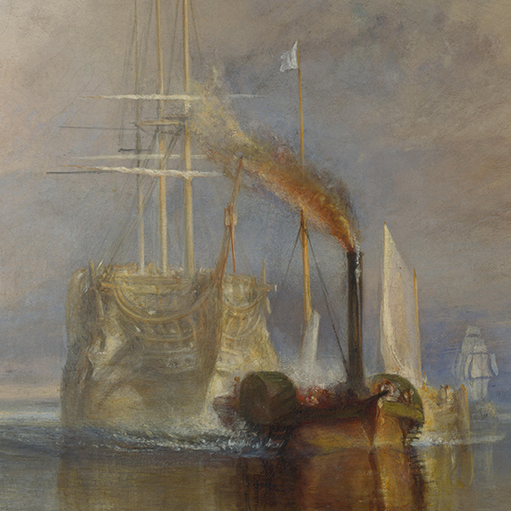

<p align="center">
  <a href="https://creativedestruction2021.org/?ref=github">
    
  </a>
</p>
<h1 align="center">
  the Economics of Creative Destruction Conference Website
</h1>

[](https://app.netlify.com/sites/creativedestruction2021/deploys)   
 
## ℹ Description

This repository holds the website source code for the [conference in the economics of creative destruction](https://creativedestruction2021.org/?ref=github).

## 🛠 Usage

If you want to run the website locally, make sure to have [node](https://nodejs.dev/learn/how-to-install-nodejs) installed and [gatsby CLI](https://www.gatsbyjs.com/docs/reference/gatsby-cli). Then, in the root directory run
```{sh}
gatsby develop
```
See [gatsby local development](https://www.gatsbyjs.com/docs/how-to/local-development/) to know more.

## ⚙ Tech Stack
As we are holding the code for a conference in innovations, we have the duty to build the website using the latest technologies available.
  - __Framework__: [Gatsbyjs](https://www.gatsbyjs.com/)
  - __CI & Hosting__: [Netlify](https://www.netlify.com/)
  - __Analytics__: [Goatcounter](https://www.goatcounter.com/)

